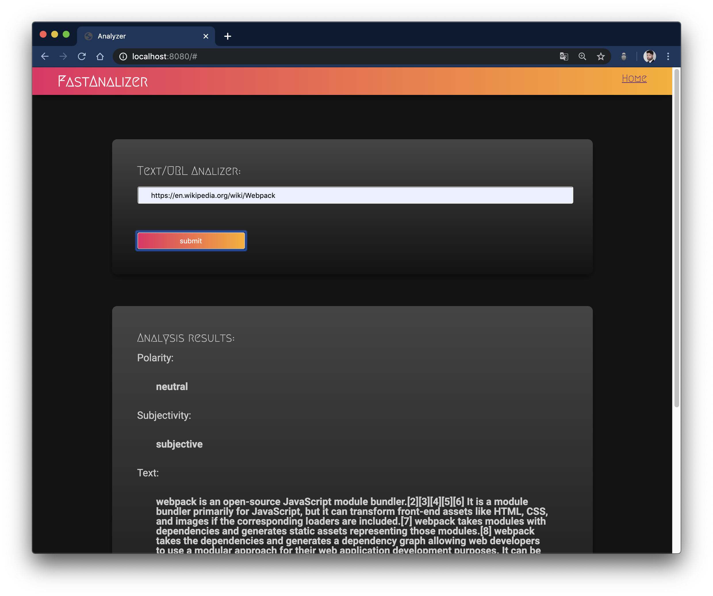
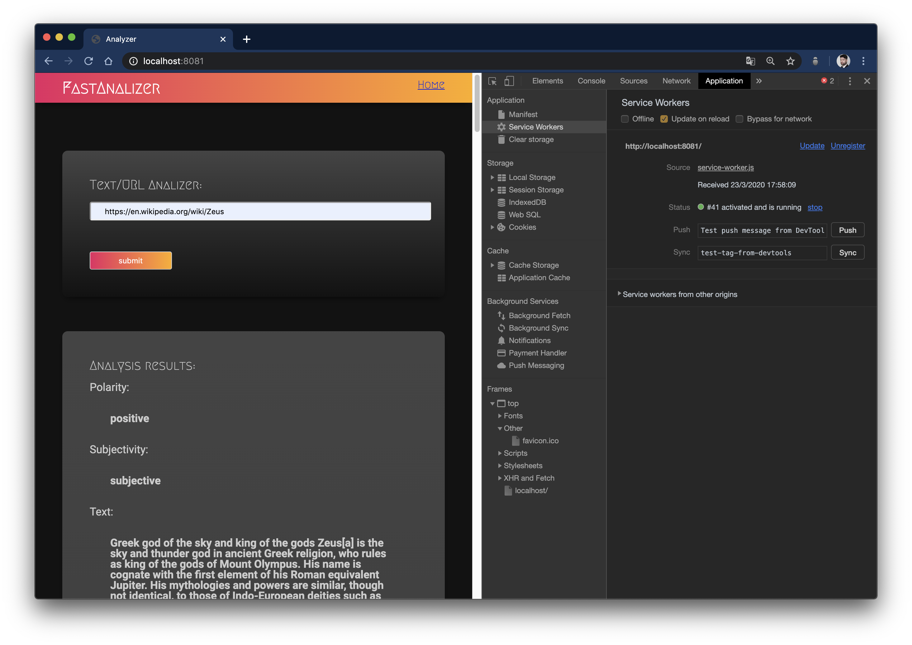
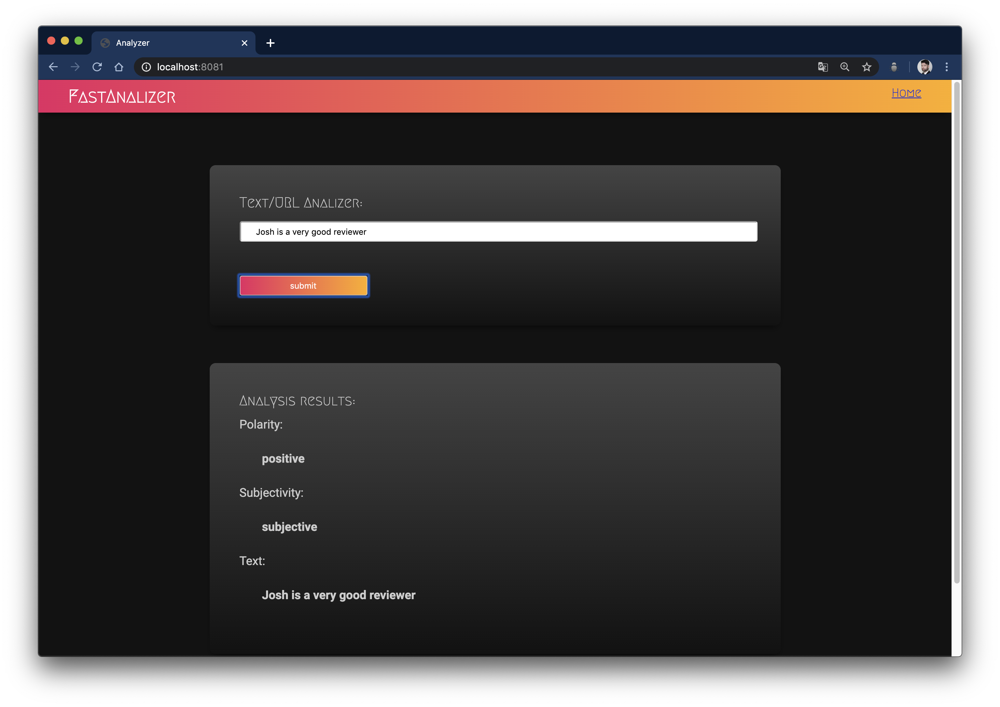
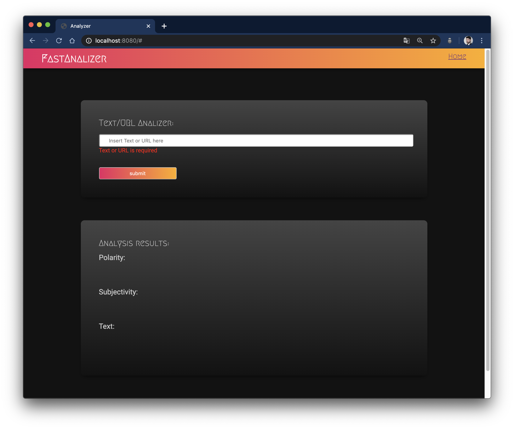

# Project Evaluate a News Article with Natural Language Processing

This project requires you to build a web tool that allows users to run Natural Language Processing (NLP) on articles or blogs found on other websites.

This project is using *Aylien*, a News Intelligence Platform 

## Technologies

- [Webpack](https://webpack.js.org/)
- [Node](https://nodejs.org/es/)
- [Sass](https://sass-lang.com/)
- [Aylien](https://aylien.com/)
- [Service Workers](https://developers.google.com/web/fundamentals/primers/service-workers?hl=es)

## Notes

The Aylien API has an endpoint named *sentiment* that accepts text or url, 
then this project has possibility to analyze text or URLs and validates if the user put an input text.

See more: [API Documentation](https://docs.aylien.com/textapi/endpoints/#sentiment-analysis)

If text is and URL, then, dynamically will analize URL from text, else, web page is going to analyze the text.

## Screenshots

   
